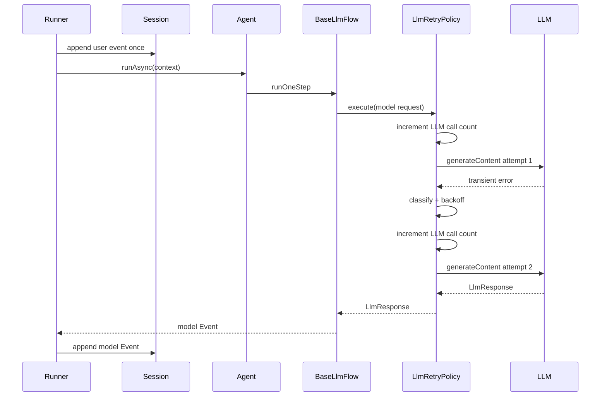

# POC: Retry Mechanism for Google ADK Java Agent Runner

## Summary

Add an opt-in retry mechanism for transient LLM call failures in the Google ADK Java runner flow. The POC should retry the model call boundary inside `BaseLlmFlow`, not the whole `Runner.runAsync(...)` invocation.

This keeps session semantics clean:

- The user event is appended once by `Runner`.
- Failed transient model attempts are not appended as model events.
- A successful retry produces the same event stream shape as a normal successful model call.
- Tool execution and other side effects are not repeated by a broad runner retry.

## Current Flow

The current execution path is:

1. `Runner.runAsyncImpl(...)` receives the user message.
2. `Runner` appends the user message to the session.
3. `Runner.runAgentWithUpdatedSession(...)` invokes `agent.runAsync(...)`.
4. `BaseLlmFlow.runOneStep(...)` preprocesses the request and calls `context.incrementLlmCallsCount()`.
5. `BaseLlmFlow.callLlm(...)` resolves the model and calls `llm.generateContent(...)`.
6. Each emitted model response is converted to an ADK `Event` and appended by `Runner`.

Because the session is already mutated before agent execution starts, retrying the entire runner invocation can duplicate user/session effects. The safer POC boundary is the `llm.generateContent(...)` call in `BaseLlmFlow`.

## Goals

- Retry transient LLM provider failures with exponential backoff.
- Preserve existing behavior by default.
- Avoid duplicate user messages, model events, and tool executions.
- Respect `RunConfig.maxLlmCalls()`.
- Provide observable retry metadata in logs/traces.
- Keep the implementation reusable for all ADK Java agents.

## Non-Goals

- Retrying an entire agent run.
- Retrying tool execution side effects.
- Retrying failures after partial streaming content has already been emitted.
- Changing default runner behavior for existing callers.
- Adding Notify-specific retry behavior in `AgentWrapper` as the primary solution.

## Proposed Design

### 1. Add `RetryConfig`

Introduce a small config object, preferably under `com.google.adk.agents`, and add it to `RunConfig`.

Example:

```java
RunConfig runConfig =
    RunConfig.builder()
        .maxLlmCalls(12)
        .retryConfig(
            RetryConfig.builder()
                .maxAttempts(3)
                .initialBackoff(Duration.ofMillis(500))
                .maxBackoff(Duration.ofSeconds(8))
                .multiplier(2.0)
                .jitterRatio(0.2)
                .build())
        .build();
```

Default:

```java
RetryConfig.disabled(); // maxAttempts = 1
```

Suggested fields:

- `maxAttempts`: total model call attempts, including the first attempt.
- `initialBackoff`: first retry delay.
- `maxBackoff`: upper delay bound.
- `multiplier`: exponential growth multiplier.
- `jitterRatio`: randomization ratio to avoid retry bursts.
- `retryableStatusCodes`: default `408`, `429`, and `5xx`.

### 2. Classify Failures

Retry only failures that are likely transient.

Retryable:

- HTTP `408`, `429`, `500`, `502`, `503`, `504`.
- Network timeout.
- Connection reset.
- Provider unavailable or rate-limit exceptions.
- Streaming/SSE failure before the first model response is emitted.

Non-retryable:

- `400` prompt/schema/tool protocol errors.
- `401` or `403` authentication and authorization errors.
- `404` model or endpoint misconfiguration.
- `LlmCallsLimitExceededException`.
- Tool response mismatch errors.
- Failures after any model response has been emitted for the current call.

### 3. Retry at the Model Call Boundary

Wrap this call in `BaseLlmFlow.callLlm(...)`:

```java
llm.generateContent(finalLlmRequest, context.runConfig().streamingMode() == StreamingMode.SSE)
```

The retry wrapper should run before model responses are converted to events. This prevents failed attempts from becoming session history.

Recommended shape:

```java
Flowable<LlmResponse> modelResponses =
    LlmRetryPolicy.execute(
        context,
        llm,
        finalLlmRequest,
        context.runConfig().streamingMode() == StreamingMode.SSE);
```

The policy should:

- Stop immediately when retry is disabled.
- Increment and enforce the LLM call budget for every real provider attempt.
- Retry only when the classifier marks the error retryable.
- Stop retrying once any `LlmResponse` has been emitted.
- Preserve cancellation and backpressure behavior from the original `Flowable`.

### 4. Move LLM Call Counting Into Attempts

Today `BaseLlmFlow.runOneStep(...)` calls `context.incrementLlmCallsCount()` once before `callLlm(...)`.

For retry support, each actual provider attempt should count toward `maxLlmCalls()`. The POC should move the increment into the retry policy so the budget reflects real model calls:

```java
context.incrementLlmCallsCount();
return llm.generateContent(request, stream);
```

If `maxLlmCalls()` is reached while retrying, return `LlmCallsLimitExceededException` without another provider call.

## Sequence



## Implementation Plan

1. Add `RetryConfig` with disabled defaults.
2. Add `retryConfig()` to `RunConfig` and copy it in `RunConfig.builder(RunConfig)`.
3. Add `LlmRetryPolicy` and a provider error classifier.
4. Replace direct `llm.generateContent(...)` usage in `BaseLlmFlow.callLlm(...)` with the retry policy.
5. Move LLM call counting from `runOneStep(...)` into the retry policy.
6. Add trace/log attributes: invocation id, agent name, model, attempt, delay, and error class.
7. Keep Notify `AgentWrapper` unchanged for the first POC, except optional wiring later through application properties.

## Test Plan

Add focused unit tests with a fake `BaseLlm`.

Required cases:

- Retry disabled: one failed provider call returns the original error.
- Retry enabled: first call fails with retryable error, second succeeds.
- Non-retryable error: no retry.
- Retry attempts exhausted: final error is returned.
- LLM call limit: retries consume `maxLlmCalls()`.
- Session shape: one user event and one successful model event, with no failed-attempt events.
- Streaming: retry only if no `LlmResponse` was emitted before the error.

## Acceptance Criteria

- Existing callers see no behavior change unless `RetryConfig.maxAttempts() > 1`.
- Transient provider failures retry with bounded exponential backoff.
- Failed retry attempts do not create persisted ADK events.
- Tool calls are not replayed by the retry layer.
- `maxLlmCalls()` remains an upper bound across retries.
- Retry behavior is covered by unit tests and visible in logs/traces.

## Risks and Open Questions

- Provider SDKs expose errors differently, so the classifier may need adapters per model implementation.
- Streaming retries are only safe before the first emitted response unless the flow buffers the entire response.
- Tool execution retries require separate idempotency design and should not be part of this POC.
- Counting failed attempts toward `maxLlmCalls()` is safer for cost control, but this should be confirmed with product expectations.
- Backoff scheduling should use RxJava schedulers so cancellation still stops pending retries.

## Recommendation

Build the POC at the `BaseLlmFlow` model-call boundary with retry disabled by default. Avoid runner-level or Notify-wrapper retries because they can replay session mutations and tool side effects. After the POC proves correctness, expose the retry settings through application properties for Notify agent runs.
